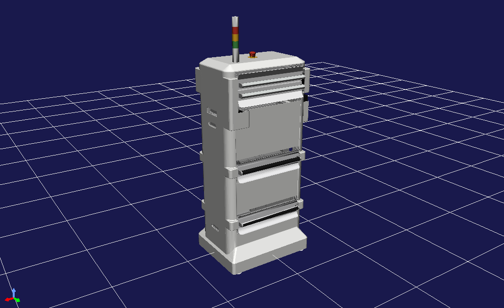

# amabie_description
This packages provides you with model files of Amabie Type-1, a UV robot developed by Society for the Study of Robotics, Tokyo Institute of Technology.

The main model file of Amabie is `body/amabie.body`. You can view the file on [Choreonoid](https://choreonoid.org/en/).

